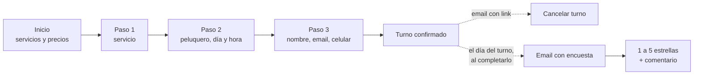

# 1. Visión general

## El problema

Barbería Esquina 1290 coordina los turnos por WhatsApp y llamadas. Eso implica:

- no hay registro de clientes ni historial;
- no hay métricas (cuántos turnos, cuántos faltan, qué tan conformes quedan);
- el cliente depende de que alguien le conteste para reservar.

## La solución

Una aplicación web con dos caras:

| | Cliente | Equipo de la barbería |
|---|---|---|
| Dónde | Celular (desde 320 px de ancho) | Computadora (desde 1024 px) |
| Cuenta | No necesita | Email y contraseña |
| Qué hace | Ve servicios y precios, elige peluquero, día y horario, reserva, cancela con un link, responde la encuesta | Agenda, cobros, clientes, métricas, opiniones, equipo, servicios, horarios |

### Recorrido del cliente

### Qué ve cada rol del panel

| Dueño | Barbero |
|---|---|
| Todo: agenda, pagos, clientes, dashboard, opiniones, peluqueros, servicios, horarios | Agenda del equipo (solo toca sus turnos), opiniones del equipo y sus horarios (sin editar) |

Detalle completo en [7. Roles y permisos](07-roles-y-permisos.md).

## Alcance: lo que pide la tesis y lo que se agregó

La documentación de la materia (escrita para "Necks Hair Salon", que es este mismo proyecto) plantea **un solo barbero** como
super admin. Durante el desarrollo se decidió extenderlo:

| Tema | Tesis | Este sistema |
|---|---|---|
| Barberos | Uno | Varios, con rol (dueño o barbero), comisión y servicios que hace |
| Pagos | No se registran | Cobro por turno (efectivo, transferencia, Mercado Pago) y liquidación por peluquero |
| Clientes | Tabla sin pantalla | Pantalla con buscador, filtros y ficha con historial |
| Opiniones | Métricas en el dashboard | Además, una pantalla de opiniones que ve todo el equipo |
| Identidad visual | Negro y dorado | Negro y azul, tomados del logo real |

En las pantallas del panel, lo agregado lleva la etiqueta **"Extensión"**. En el código, los comentarios usan `[EXT]` o
`[Extensión]`. Todas las diferencias con el modelo de datos están en [4. Modelo de datos](04-modelo-de-datos.md#diferencias-con-la-etapa-2).

## Cómo se construyó

1. **Maqueta** (`maqueta/`): todas las pantallas en HTML/CSS/JS con datos inventados, para validar el diseño.
2. **Backend** (`backend/`): la API en Spring Boot con MySQL, con tests.
3. **Frontend** (`frontend/`): las pantallas de la maqueta pasadas a React y conectadas a la API.

## Estado

| Parte | Estado |
|---|---|
| Maqueta | Completa (referencia de diseño) |
| API | Completa: 19 endpoints de la Etapa 4 + extensión · 36 tests |
| Sitio del cliente | Completo y probado en celular (375 y 320 px) |
| Panel de gestión | Completo y probado en escritorio (1366 y 1024 px) |
| Datos reales del local | **Pendiente**: precios, dirección, teléfono (hoy son de relleno) |
| Publicación en un servidor | **Pendiente** |

Lo que falta está en [12. Pendientes](12-pendientes.md).
