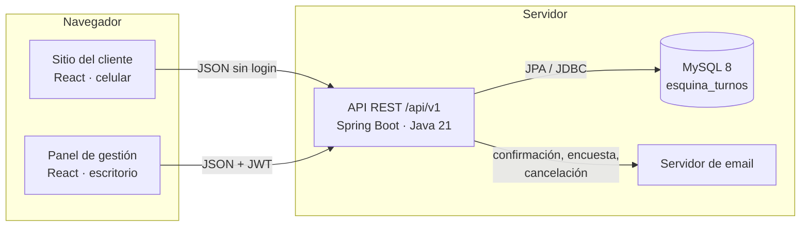
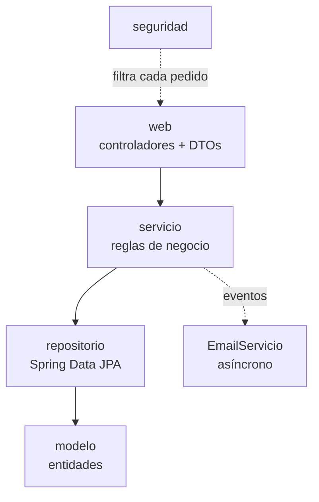
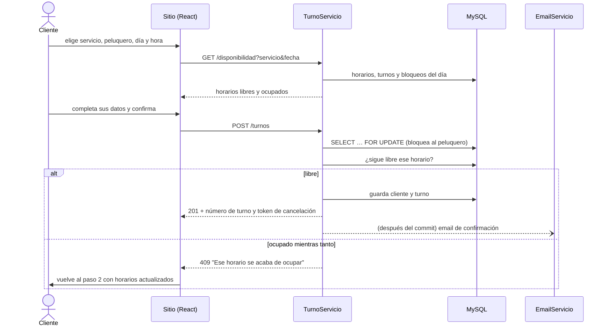
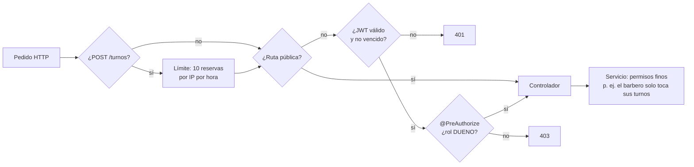

# 3. Arquitectura

## Vista general

SPA + API REST, como plantea la Etapa 3. Tres piezas independientes que se hablan por HTTP y JDBC:



En desarrollo el front corre en `localhost:5173` (Vite) y reenvía `/api` a `localhost:8080`, así el navegador ve un solo
origen y no hace falta CORS. En producción se puede servir todo desde el mismo dominio o apuntar el front a otra URL con
`VITE_API_URL`.

## Backend: arquitectura en capas

```
backend/src/main/java/com/barberiaesquina/turnos/
├── web/           Controladores REST, DTOs (records) y manejo de errores
├── servicio/      Lógica de negocio y transacciones
├── repositorio/   Acceso a datos (Spring Data JPA)
├── modelo/        Entidades JPA y enums
├── seguridad/     JWT, roles, límite de reservas por IP
├── config/        Propiedades app.* y reloj con zona horaria de Córdoba
└── demo/          Dueño inicial y datos de ejemplo
```

Cada capa solo usa la de abajo:



| Capa | Responsabilidad | Ejemplo |
|---|---|---|
| `web` | Recibir el pedido, validar el formato (`@Valid`), llamar al servicio, devolver JSON. Sin lógica. | `TurnoControlador` |
| `servicio` | Reglas del negocio, transacciones, permisos finos | `TurnoServicio.reservar()` |
| `repositorio` | Consultas | `TurnoRepositorio.entre(desde, hasta, barbero)` |
| `modelo` | Entidades que reflejan las tablas | `Turno`, `EstadoTurno` |

### Decisiones técnicas

| Decisión | Por qué |
|---|---|
| **Spring Boot 4.1** (y no 3) | Es la versión con soporte al momento de desarrollar; la 3.x ya no tiene soporte gratuito. |
| **Flyway** maneja el esquema; Hibernate no toca tablas (`ddl-auto: none`) | El SQL queda versionado y revisable; igual al modelo de la Etapa 2. |
| **DTOs como `record`** separados de las entidades | La API no expone la base tal cual (ni `password_hash`, ni relaciones perezosas). |
| **Enums en minúscula** (`"pendiente"`, `"mercadopago"`) en la base y en el JSON | Igual a los `ENUM` del SQL. `ValorEnum` hace la conversión. |
| **Un `Clock` inyectado** con la zona de Córdoba | "Ahora" y "hoy" no dependen de la zona del servidor, y los tests usan un reloj fijo. |
| **Errores en formato Problem Details** (RFC 9457) | Todos los errores tienen la misma forma y un mensaje listo para mostrar. |
| **Emails por eventos, después del commit y en otro hilo** | La reserva responde enseguida y nunca sale un email de algo que no se guardó. |
| **JWT sin sesión en el servidor** | La API no guarda estado; escala a varias instancias. |

## Cómo viaja una reserva



El detalle de por qué dos reservas simultáneas no pueden quedarse con el mismo horario está en
[8. Reglas de negocio](08-reglas-de-negocio.md#reservas-simultáneas).

## Seguridad



- **Contraseñas** con bcrypt (costo 10). El login responde igual y tarda lo mismo si el email no existe.
- **JWT** firmado (HS256), con emisor y vencimiento de 8 h. Lleva el id, el nombre y el rol.
- **Rutas públicas**: todo lo que usa el cliente (servicios, peluqueros, horarios, disponibilidad, reseñas, reservar,
  cancelar con token, encuesta con token).
- **Tokens de los emails** (cancelación y encuesta): 256 bits aleatorios, comparados en tiempo constante. El de cancelación
  vence a las 48 h y deja de servir cuando el turno cambia de estado.
- **Permisos por rol**: ver [7. Roles y permisos](07-roles-y-permisos.md).

## Frontend

Una sola SPA con dos partes que no se mezclan:

| | Sitio del cliente | Panel |
|---|---|---|
| Rutas | `/`, `/reservar`, `/turno/confirmado`, `/cancelar/:token`, `/encuesta/:id` | `/admin/*` |
| Pensado para | Celular (mobile-first, desde 320 px) | Escritorio (desde 1024 px) |
| Carga | Con la página | Aparte, recién al entrar a `/admin` (`React.lazy`) |
| Estilos | `cliente.css`, bajo `body.cliente` | `admin.css` + `panel.css`, bajo `body.admin` |
| Datos | `fetch` sin login | `fetch` con el JWT de la sesión |

Detalle en [6. Frontend](06-frontend.md).
