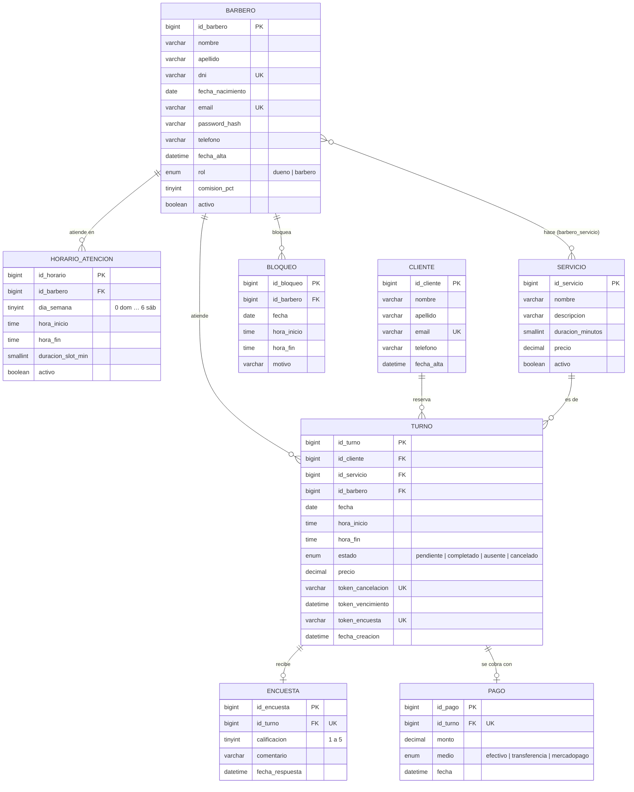
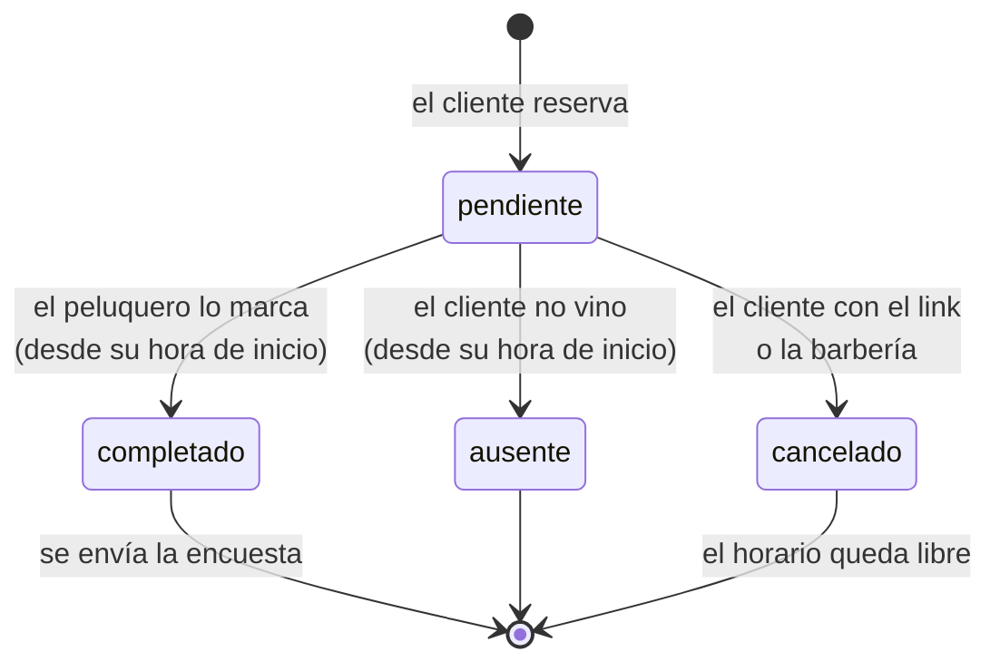

# 4. Modelo de datos

Base MySQL `esquina_turnos`. El esquema completo está en
[`backend/src/main/resources/db/migration/V1__esquema.sql`](../backend/src/main/resources/db/migration/V1__esquema.sql)
y lo aplica Flyway al arrancar la API.

## Diagrama entidad-relación

## Tablas

| Tabla | Qué guarda | Notas |
|---|---|---|
| `barbero` | Quienes usan el panel | `rol` = dueño (super admin) o barbero. `comision_pct`: parte que cobra el peluquero. Nunca se borra: se desactiva. |
| `servicio` | Catálogo (corte, barba…) | `activo = false` lo oculta al cliente sin perder el historial. |
| `barbero_servicio` | Qué servicios hace cada peluquero | Un servicio nuevo se asigna a todos los activos. |
| `horario_atencion` | Semana de cada peluquero | Uno por peluquero y día (`UNIQUE`). `duracion_slot_min`: cada cuánto arranca un turno posible. |
| `cliente` | Quienes reservaron | Se crea sola al reservar. Se reconoce por email (`UNIQUE`). |
| `turno` | Cada reserva | Guarda el `precio` del momento, así los cambios de precio no alteran el historial. |
| `encuesta` | Respuesta de satisfacción | Una por turno (`UNIQUE id_turno`). |
| `pago` | Cobro de un turno completado | Uno por turno (`UNIQUE id_turno`). |
| `bloqueo` | Franjas en que un peluquero no atiende | RF-12. No se superpone con turnos pendientes. |

Restricciones (`CHECK`) que protegen los datos aunque alguien escriba directo en la base: calificación entre 1 y 5, comisión
entre 0 y 100, precio y monto no negativos, duración mayor a 0, día de la semana entre 0 y 6, y hora de inicio anterior a la
de fin en horarios, turnos y bloqueos.

## Ciclo de vida del turno

Un turno cambia de estado **una sola vez**. Los cancelados no ocupan lugar en la agenda.

## Diferencias con la Etapa 2

En el SQL están marcadas con `[EXT]` (extensión) o `[AJUSTE]`.

| Tema | Documento | Implementación | Motivo |
|---|---|---|---|
| Barbero | Solo datos personales y login | Suma `rol`, `comision_pct`, `activo` | Varios peluqueros (extensión) |
| Servicio | Tenía `id_barbero` | Sin `id_barbero`; tabla `barbero_servicio` | Con varios peluqueros el catálogo es de la barbería |
| Turno | — | Suma `precio`, `token_vencimiento`, `token_encuesta` | Precio histórico; vencimiento de 48 h del link (RNF); que nadie responda la encuesta de otro |
| Cliente | Email sin restricción | Email `UNIQUE` | Reconocer al cliente que vuelve |
| Pago | No existía | Tabla `pago` | Extensión |
| Bloqueo | No estaba en el DER | Tabla `bloqueo` | La pide RF-12 |

## Cambiar el esquema

**Nunca** se edita `V1__esquema.sql` una vez que alguien corrió la API: Flyway detecta el cambio y no arranca. Para cambiar
algo se agrega un archivo nuevo, por ejemplo `V2__agrega_notas_a_turno.sql`. Ver [11. Guía de desarrollo](11-guia-de-desarrollo.md#cambiar-la-base).

Para ver el diagrama real en Workbench: *Database → Reverse Engineer…* sobre `esquina_turnos`.
