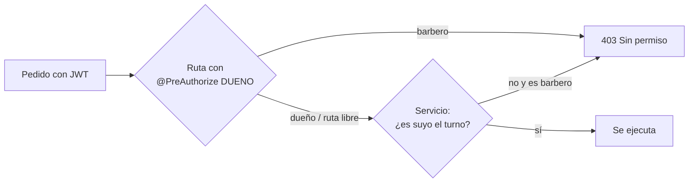

# 7. Roles y permisos

Hay tres tipos de usuario:

| | Quién | Cómo entra |
|---|---|---|
| **Cliente** | Cualquier persona | Sin cuenta. Los links de cancelación y encuesta le llegan por email con un token propio. |
| **Barbero** | Peluquero del equipo | Panel, con su email y contraseña |
| **Dueño** | El "Super Admin" de la tesis | Panel, con su email y contraseña |

Idea general: **el barbero ve su trabajo; el dueño maneja el negocio.**

## Qué puede hacer cada uno en el panel

| | Dueño | Barbero |
|---|---|---|
| **Agenda**: ver turnos | De todo el equipo | De todo el equipo |
| … datos de turnos ajenos | Todo | Cliente, servicio, hora y estado. **No** teléfono, email, cobro ni calificación |
| … números de arriba | De la barbería | Solo los suyos ("Tus turnos", "Cobraste") |
| … completar / ausente / cancelar | Cualquier turno | Solo los suyos |
| … registrar cobros | Cualquier turno | Solo los suyos |
| … bloquear o quitar franjas | Sí | No |
| **Opiniones** (encuestas de todo el equipo) | Sí | Sí |
| **Horarios** | Edita el de cualquiera | Ve el suyo ("Mis horarios"), sin editar |
| **Pagos**, **Clientes**, **Dashboard** | Sí | No los ve |
| **Peluqueros**, **Servicios** | Crea, edita, desactiva | No los ve |

Además:

- Siempre tiene que quedar **al menos un dueño activo**: no se puede desactivar ni pasar a barbero al único.
- Un peluquero **desactivado** no puede entrar al panel ni aparece para reservar, pero su historial se conserva.

## Cómo está implementado

Los permisos se controlan **en la API**. El panel solo esconde lo que no corresponde para que no haya botones que den error.

| Capa | Dónde | Qué controla |
|---|---|---|
| Ruta | `SeguridadConfig` | Qué es público y qué pide login |
| Controlador | `@PreAuthorize("hasRole('DUENO')")` | Pagos (listado), clientes, dashboard, equipo, alta y edición de servicios y peluqueros, guardar horarios, bloqueos |
| Servicio | `SesionActual` en `TurnoServicio`, `PagoServicio`, `HorarioServicio`, `BloqueoServicio` | "Solo los suyos": cambiar estado, cobrar |
| Datos | `TurnoServicio.listar()` → `Detalle.sinDatosPrivados()` | Quita contacto, cobro y calificación de turnos ajenos |
| Panel | `SoloDueno` en las rutas y `esDueno` en el menú y los botones | Qué se muestra |

El rol viaja en el JWT (`"roles": ["DUENO"]`) y Spring lo convierte en `ROLE_DUENO`.

Cada una de estas reglas tiene su test en `SeguridadTest` (ver [10. Pruebas](10-pruebas.md)).
