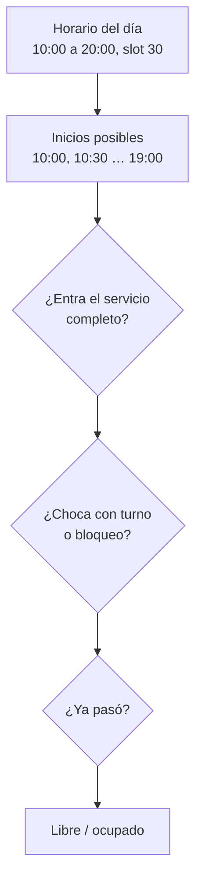

# 8. Reglas de negocio

## Disponibilidad (RF-27)

`DisponibilidadServicio` decide qué horarios se ofrecen. Para un peluquero, un horario **está libre** si se cumplen todas:

1. Ese día tiene horario de atención activo.
2. Cae sobre la grilla de su slot base (con slot de 30: 10:00, 10:30, 11:00…).
3. El servicio **entero** termina antes del cierre (un servicio de 60 min con cierre a las 20:00 empieza como tarde a las 19:00).
4. No se superpone con un turno **no cancelado** (los ausentes y completados también ocupan).
5. No se superpone con una franja **bloqueada**.
6. Si es hoy, todavía no pasó.
7. La fecha está entre hoy y hoy + 30 días.

**Sin peluquero elegido** ("Cualquiera"): un horario está libre si al menos un peluquero que hace el servicio lo tiene
libre. La API devuelve quiénes, **ordenados por cantidad de turnos ese día**, y el front sugiere al primero: así el trabajo
se reparte.

Los horarios ocupados también se devuelven (`libre: false`): el cliente los ve tachados y se da cuenta de qué tan lleno está
el día.

## Reservas simultáneas

Dos clientes pueden tocar "Confirmar" para el mismo horario al mismo tiempo. Para que se guarde uno solo:

1. La reserva **bloquea la fila del peluquero** (`SELECT … FOR UPDATE`). La segunda reserva espera a que termine la primera.
2. Recién entonces vuelve a verificar que el horario siga libre (RNF: validación en tiempo real antes de confirmar).
3. La transacción usa aislamiento **READ COMMITTED**.

El punto 3 no es un detalle. MySQL usa por defecto REPEATABLE READ: cada transacción lee una "foto" de la base tomada al
empezar. Aunque la segunda reserva esperara el bloqueo, seguía mirando la foto vieja y no veía el turno que acababa de
guardar la primera: **quedaban turnos duplicados**. Se detectó probando contra MySQL real (en H2 no pasa) y se cubre con el
test `reservasSimultaneasAlMismoHorarioSoloGuardanUna`.

Con varios peluqueros candidatos se bloquean en orden de id, para no generar *deadlocks*.

## Clientes

- No tienen cuenta. Se identifican por **email**: si vuelve a reservar con el mismo email (sin importar mayúsculas), es el
  mismo cliente y se actualizan su nombre y teléfono.
- Se registran solos al reservar.

## Ciclo del turno

| Transición | Quién | Condición | Efecto |
|---|---|---|---|
| → `pendiente` | Cliente | Horario libre | Email de confirmación con link de cancelación |
| `pendiente` → `completado` | Peluquero del turno o dueño | Desde la hora de inicio | Genera token de encuesta y envía el email |
| `pendiente` → `ausente` | Peluquero del turno o dueño | Desde la hora de inicio | — |
| `pendiente` → `cancelado` | Cliente (link) o panel | — | Email de aviso; el horario queda libre |

Un turno cerrado no vuelve a cambiar.

## Cancelación con el link (RF-06)

- El link lleva un token aleatorio de 256 bits, único por turno.
- Sirve **una vez**: al cancelar, el turno deja de estar pendiente y el token ya no hace nada.
- **Vence** a las 48 h de reservado (RNF de la tesis) o cuando empieza el turno, lo que pase primero.
- Si venció, la pantalla ofrece avisar por WhatsApp.

## Encuesta (RF-15 a RF-17)

- Se habilita solo cuando el turno se marca **completado**.
- El link lleva `idTurno` + un token propio: nadie puede responder la encuesta de otro cambiando el número.
- Se responde una sola vez: 1 a 5 estrellas y un comentario opcional de hasta 500 caracteres.

## Cobros (extensión)

- Solo se cobran turnos **completados**, uno por turno.
- El monto arranca en el precio del turno y se puede ajustar (propina, descuento).
- **Liquidación:** a cada peluquero le toca `monto × comisión %`; el resto es "para la casa". El dueño tiene comisión 0.

## Bloqueos (RF-12)

- Franja en la que un peluquero no toma turnos (trámite, almuerzo, feriado).
- No se puede bloquear encima de turnos pendientes: primero hay que cancelarlos (y así el cliente recibe el aviso).
- No se puede bloquear un día pasado.

## Horarios

- Cada peluquero tiene su semana; la barbería "abre" un día si atiende al menos uno.
- Cambiar un horario **no toca** turnos ya reservados: solo cambia lo que se ofrece de ahí en adelante.

## Servicios

- Un servicio con turnos no se borra (perdería el historial): se **oculta**.
- Un servicio nuevo lo hacen todos los peluqueros activos; después se ajusta en la ficha de cada uno.
- El turno guarda el precio del momento: cambiar un precio no altera lo ya facturado.

## Límite de reservas (RNF)

Como máximo **10 reservas por hora desde la misma conexión** (IP). La que se pasa recibe 429. Evita que alguien llene la
agenda con turnos falsos. En producción, detrás de un proxy HTTPS, la IP real la resuelve el servidor
(`forward-headers-strategy`); no se lee el header `X-Forwarded-For` a mano porque se puede falsificar.

## Emails

| Cuándo | Asunto | Contenido |
|---|---|---|
| Al reservar | "Tu turno está confirmado" | Resumen + link para cancelar |
| Al completar | "¿Cómo te atendimos?" | Link a la encuesta |
| Al cancelar | "Tu turno fue cancelado" | Resumen + link para reservar otro |

Se envían **después** de guardar y en segundo plano: la reserva no espera al servidor de correo, y si el correo falla el turno
igual queda guardado (se registra en el log). En desarrollo están apagados y solo se anotan en el log.
